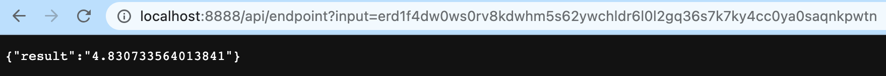

# HRI app, a Jacks.Media tool for Combased.io

The result of this code is [deployed here](https://comverse.netlify.app/).

This webapp provides calculations of metadata based upon wallet addresses on the MultiversX blockchain.

Features:
- data in table form to explain HRI scores
- outlinks to client resources

This website is built using [Docusaurus 2](https://docusaurus.io/), a modern static website generator. Netlify is used for cloud functions and hosting.

### Installation

```
$ yarn
```
Or
```
$ npm install
```

### Local Development

```
node appy.js
```

Runs the express ewndpoint locally. Can be tested in against the local CSV in this way:
`http://localhost:3000/hri/erd159mypt4myss3mqrs89ft0hjeacffks2690gq9u3mlh73m9sh0w5s09eqhh`


```
$ netlify dev
```

This command starts a local development server as well as a lambda proxy server. Use the following link to test the 'hello' API function in ```src/netlify/functions``` directory:

```http://localhost:8888/api/hello?name=Viktor```

Modify and add to functions in this directory & Netlify will build them.

This is the test of the API response function, endpoint.ts:

```http://localhost:8888/api/ endpoint?input=erd1f4dw0ws0rv8kdwhm5s62ywchldr6l0l2gq36s7k7ky4cc0ya0saqnkpwtn```



This is the test of the blockchain scraper & collation function, still not working as expected in typescript vs python:

```http://localhost:8888/api/main```

### Build Locally

```
$ yarn build
```

This command generates static content into the `build` directory and can be served using any static contents hosting service.

### Deployment

See [Netlify docs](https://www.netlify.com/products/deploy-previews/?utm_medium=paid_search&utm_source=google&utm_campaign=GS_Connect:+Netlify+Brand&utm_term=netlify) for info about signing up, and then hosting this. Logging in with GitHub will make the deployments very easy, and also continuous. 